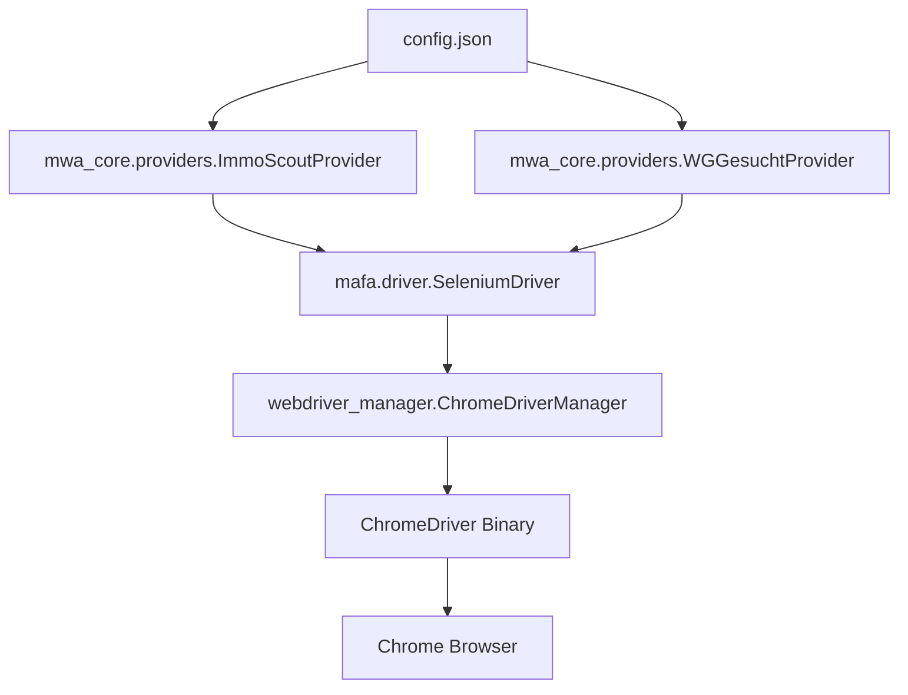

# Chrome Driver Setup Plan

## Overview
This plan addresses common Selenium/ChromeDriver issues to get real data scraping working for the MWA-MüncheWohnungsAssistent project.

## Current Architecture


## Common Issues & Solutions

### 1. **webdriver_manager Installation**
- **Problem**: `webdriver_manager` not installed or outdated
- **Solution**: Install/update via Poetry
- **Command**: `poetry add webdriver-manager`

### 2. **Chrome Browser Not Found**
- **Problem**: Chrome browser not installed or not in PATH
- **Solution**: Install Chrome or specify binary location
- **macOS**: `brew install --cask google-chrome`

### 3. **ChromeDriver Permission Issues**
- **Problem**: ChromeDriver binary not executable
- **Solution**: Fix permissions on the driver binary
- **Command**: `chmod +x /path/to/chromedriver`

### 4. **Version Mismatch**
- **Problem**: Chrome and ChromeDriver versions don't match
- **Solution**: `webdriver_manager` handles this automatically, but may need manual intervention

### 5. **Headless Mode Issues**
- **Problem**: Some sites block headless browsers
- **Solution**: Add additional Chrome options to avoid detection

## Implementation Steps

### Phase 1: Environment Setup
1. Verify Poetry installation and dependencies
2. Install/update webdriver_manager
3. Check Chrome browser installation
4. Create proper config.json from example

### Phase 2: Driver Enhancement
1. Enhance `mafa/driver.py` with better error handling
2. Add Chrome options to avoid detection
3. Implement logging for debugging
4. Add fallback mechanisms

### Phase 3: Provider Updates
1. Update ImmoScout provider with robust error handling
2. Update WG-Gesucht provider with robust error handling
3. Add retry logic and timeouts
4. Implement proper logging

### Phase 4: Testing & Verification
1. Create test script for basic driver functionality
2. Test each provider individually
3. Verify data extraction from real websites
4. Create monitoring and logging system

## Enhanced Chrome Options
```python
# Add these options to avoid detection
options.add_argument("--no-sandbox")
options.add_argument("--disable-dev-shm-usage")
options.add_argument("--disable-blink-features=AutomationControlled")
options.add_experimental_option("excludeSwitches", ["enable-automation"])
options.add_experimental_option('useAutomationExtension', False)
```

## Verification Script
A test script will be created to:
1. Test basic ChromeDriver functionality
2. Verify connection to test websites
3. Check provider implementations
4. Validate data extraction

## Error Handling Strategy
- Implement try/catch blocks with specific error messages
- Add retry logic with exponential backoff
- Log all errors with context for debugging
- Provide clear error messages to users

## Next Steps
Switch to Code mode to implement these fixes and get the Chrome driver working with real data scraping.