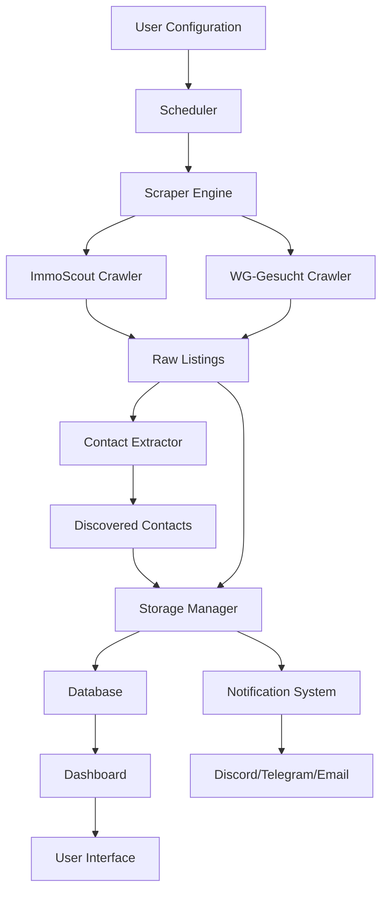

# MAFA Application Architecture Analysis

## Overview
The Munich Apartment Finder Assistant (MAFA) is a comprehensive system for automated apartment hunting that combines web scraping, contact discovery, and notification management. The application is built with a modular architecture that separates concerns across multiple layers.

## System Architecture

### Core Components

#### 1. API Layer (`/api/`)
The API layer provides RESTful endpoints for all system operations:

**Configuration Management** (`api/routers/config.py`)
- **Endpoints**: `GET /`, `PUT /`, `POST /validate`, `POST /reset`, `POST /export`, `POST /import`, `GET /sections`
- **Purpose**: Manage application settings, validation, import/export
- **Key Features**: Section-based configuration, sensitive data filtering, backup/restore

**Contact Management** (`api/routers/contacts.py`)
- **Endpoints**: `GET /`, `GET /{id}`, `POST /`, `PUT /{id}`, `DELETE /{id}`, `POST /validate/{id}`, `POST /search`, `GET /statistics/summary`, `POST /export`
- **Purpose**: CRUD operations for discovered contacts, validation, search, statistics
- **Key Features**: Filtering by type/status/confidence, pagination, bulk operations

**Listing Management** (`api/routers/listings.py`)
- **Endpoints**: `GET /`, `GET /{id}`, `POST /`, `PUT /{id}`, `DELETE /{id}`, `POST /search`, `GET /statistics/summary`, `POST /export`
- **Purpose**: Manage apartment listings from scraped data
- **Key Features**: Price filtering, provider filtering, status management

**Scheduler Management** (`api/routers/scheduler.py`)
- **Endpoints**: `GET /status`, `GET /jobs`, `GET /jobs/{id}`, `POST /jobs`, `PUT /jobs/{id}`, `DELETE /jobs/{id}`, `POST /jobs/{id}/pause`, `POST /jobs/{id}/resume`, `POST /jobs/{id}/trigger`, `GET /executions`, `GET /config`, `PUT /config`, `POST /start`, `POST /stop`
- **Purpose**: Manage automated job scheduling and execution
- **Key Features**: Cron-style scheduling, job pause/resume, manual triggers

**Scraper Control** (`api/routers/scraper.py`)
- **Endpoints**: `GET /status`, `POST /start`, `GET /statistics`, `GET /providers`, `PUT /config`, `POST /test`, `GET /runs`
- **Purpose**: Control and monitor web scraping operations
- **Key Features**: Provider management, configuration updates, test runs

**System Monitoring** (`api/routers/system.py`)
- **Endpoints**: `GET /health`, `GET /health/detailed`, `GET /info`, `GET /performance`, `GET /components`, `POST /errors`, `GET /logs`, `GET /metrics`, `GET /version`, `POST /shutdown`
- **Purpose**: System health checks, performance monitoring, error reporting
- **Key Features**: Component status, resource usage, error logging

#### 2. Backend Core (`/mafa/` and `/mwa_core/`)

**Web Scrapers** (`mafa/crawler/`)
- **immoscout.py**: Scrapes ImmoScout24.de for apartment listings
- **wg_gesucht.py**: Scrapes WG-Gesucht.de for shared accommodations
- **Features**: Selenium-based, headless Chrome, error handling

**Contact Discovery** (`mafa/contacts/`)
- **extractor.py**: Main contact extraction engine
- **Features**: Email/phone/form extraction, confidence scoring, validation
- **Patterns**: Multiple email obfuscation patterns, German phone formats

**Data Providers** (`mafa/providers/`)
- **base.py**: Protocol definition for scraper providers
- **Integration**: Standardized interface for different apartment sites

**Scheduler** (`mafa/scheduler/`)
- **scheduler.py**: APScheduler-based job scheduling
- **Features**: Periodic scraping, cron expressions, job management

**Storage** (`mwa_core/storage/`)
- **manager.py**: Enhanced storage manager with SQLAlchemy ORM
- **Features**: Deduplication, migrations, backups, relationships
- **Models**: Listings, Contacts, ScrapingRuns, Jobs

#### 3. Frontend Dashboard (`/dashboard/`)

**Templates** (`dashboard/templates/`)
- **index.html**: Main dashboard with real-time monitoring
- **contacts.html**: Contact review and management interface

**Static Assets** (`dashboard/static/`)
- **dashboard.js**: Core JavaScript functionality
- **dashboard.css**: Styling and layout

**Features**:
- Real-time WebSocket updates
- Contact review workflow (approve/reject)
- System status monitoring
- Bulk operations and export functionality

### Data Flow Architecture

### Configuration Requirements

#### Essential User Settings
1. **Personal Profile**
   - Full name, profession, employer
   - Monthly income, number of occupants
   - Introduction paragraph for applications

2. **Search Criteria**
   - Maximum price, minimum rooms
   - Target ZIP codes in Munich
   - Preferred districts

3. **Notification Preferences**
   - Provider selection (Discord/Telegram/Email)
   - Webhook URLs or contact details
   - Notification frequency

4. **Scraping Configuration**
   - Enabled providers (ImmoScout, WG-Gesucht)
   - Scraping intervals and schedules
   - Rate limiting settings

5. **Contact Discovery**
   - Confidence thresholds
   - Preferred contact methods
   - Validation settings

### API Endpoints Summary

| Router | Endpoint | Method | Purpose |
|--------|----------|--------|---------|
| config | `/` | GET | Get configuration |
| config | `/` | PUT | Update configuration |
| contacts | `/` | GET | List contacts |
| contacts | `/search` | POST | Search contacts |
| listings | `/` | GET | List listings |
| listings | `/search` | POST | Search listings |
| scheduler | `/status` | GET | Scheduler status |
| scheduler | `/jobs` | GET | List scheduled jobs |
| scraper | `/status` | GET | Scraper status |
| scraper | `/start` | POST | Start scraping |
| system | `/health` | GET | Health check |
| system | `/info` | GET | System information |

### Key Features for User Flow Design

#### 1. **Setup Flow**
- Configuration wizard for initial setup
- Validation of settings before saving
- Import/export for backup/restore

#### 2. **Monitoring Flow**
- Real-time dashboard with WebSocket updates
- System health and performance metrics
- Contact review and approval workflow

#### 3. **Automation Flow**
- Scheduled scraping jobs
- Automatic contact discovery
- Notification delivery

#### 4. **Management Flow**
- Bulk contact operations
- Search and filtering capabilities
- Data export functionality

### Technical Considerations

#### Strengths
- Modular architecture with clear separation of concerns
- Comprehensive API coverage for all operations
- Real-time monitoring capabilities
- Robust error handling and validation
- Extensible provider system

#### Areas for Improvement
- Frontend is currently dashboard-focused, needs simplified user interface
- Configuration complexity may overwhelm new users
- Limited guided setup process
- No mobile-responsive design

#### Security Considerations
- Sensitive data handling (webhooks, tokens)
- Rate limiting and request throttling
- Input validation and sanitization
- Secure configuration management

This architecture provides a solid foundation for creating user-friendly flows that abstract away the complexity while maintaining the powerful backend capabilities.