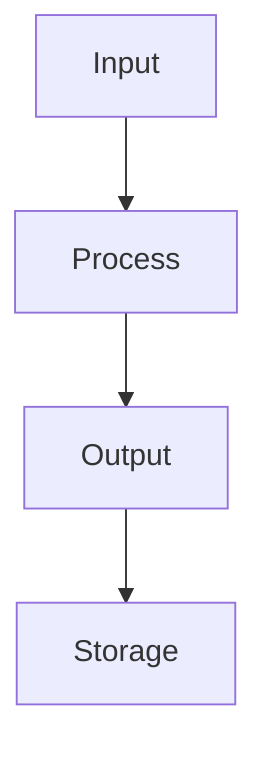
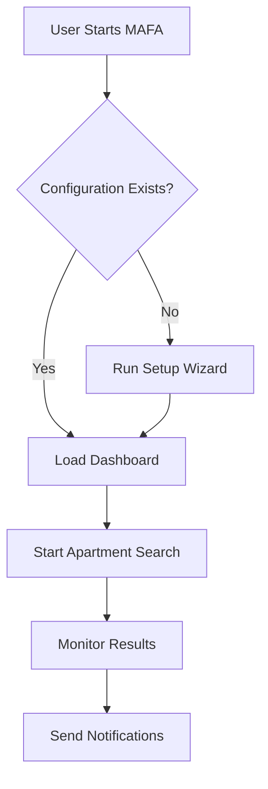

# Documentation Guidelines

## Overview
This guide defines the standards and best practices for writing, maintaining, and organizing documentation for the MAFA project. Good documentation is crucial for user adoption, developer productivity, and project maintenance.

---

**Last Updated:** November 19, 2025  
**Version:** 1.0.0  
**Maintainer:** MAFA Documentation Team  
**Estimated Reading Time:** 10-15 minutes

---

## Documentation Philosophy

### Core Principles
- **User-First**: Write from the perspective of the person using the documentation
- **Clear and Concise**: Use simple, direct language
- **Practical**: Focus on real-world usage scenarios
- **Comprehensive**: Cover both basic and advanced topics
- **Up-to-Date**: Keep documentation current with code changes
- **Accessible**: Make content accessible to users with different skill levels

### Documentation Goals
- **Enable Adoption**: Help new users get started quickly
- **Support Development**: Provide clear guidance for contributors
- **Facilitate Maintenance**: Document architecture and decisions
- **Ensure Consistency**: Standardize terminology and formatting
- **Improve UX**: Reduce support requests through clear documentation

---

## Documentation Types

### User Documentation
**Purpose**: Help end users understand and use MAFA effectively

#### User Guide Documents
```
docs/user-guide/
├── overview.md              # Complete user guide introduction
├── setup-wizard.md          # Step-by-step configuration
├── dashboard.md             # Interface and features guide
└── troubleshooting.md       # Problem-solving guide
```

#### Getting Started Documents
```
docs/getting-started/
├── installation.md          # Complete installation guide
├── quick-start.md          # 5-minute setup guide
└── configuration.md        # Configuration reference
```

#### Characteristics
- **Beginner-Friendly**: Assumes minimal technical knowledge
- **Step-by-Step**: Clear progression through tasks
- **Visual**: Screenshots, diagrams, and code examples
- **Actionable**: Focused on what users can do
- **Problem-Solving**: Addresses common user issues

### Developer Documentation
**Purpose**: Guide developers in understanding, contributing to, and extending MAFA

#### Technical Documents
```
docs/developer-guide/
├── development-setup.md     # Development environment setup
├── contributing.md          # How to contribute
├── code-style.md           # Coding standards
├── documentation-guidelines.md # This document
└── api/
    └── integration-guide.md # API integration guide
```

#### Characteristics
- **Technical Depth**: Includes architectural details
- **Code Examples**: Practical implementation examples
- **Best Practices**: Patterns and anti-patterns
- **API References**: Complete function/class documentation
- **Troubleshooting**: Common development issues

### Architecture Documentation
**Purpose**: Document system design, decisions, and technical architecture

#### Design Documents
```
docs/architecture/
├── system-overview.md      # High-level system architecture
├── repository-structure.md # Code organization
├── database-schema.md      # Database design
├── data-models.md          # Entity relationships
└── contact-discovery.md    # Contact extraction system
```

#### Characteristics
- **Diagrams**: Visual representations of system components
- **Rationale**: Explanation of design decisions
- **Trade-offs**: Discussion of alternatives considered
- **Evolution**: How architecture may change over time

### Project Documentation
**Purpose**: Document project management, planning, and governance

#### Management Documents
```
docs/project/
├── roadmap.md              # Future development plans
├── changelog.md            # Version history
├── release-notes.md        # Release information
└── governance.md           # Project governance
```

#### Characteristics
- **Historical**: Tracks changes and decisions over time
- **Forward-Looking**: Plans and roadmaps
- **Organizational**: Roles, responsibilities, and processes

---

## Writing Standards

### Language and Tone

#### Voice and Style
- **Active Voice**: Use active voice when possible
  - ✅ "Configure the settings" instead of "Settings should be configured"
  - ✅ "Click the button" instead of "The button should be clicked"

- **Second Person**: Address the reader as "you"
  - ✅ "You can install MAFA using Docker"
  - ❌ "MAFA can be installed using Docker"

- **Present Tense**: Use present tense for general statements
  - ✅ "The system monitors apartments continuously"
  - ❌ "The system will monitor apartments continuously"

- **Positive Tone**: Focus on what users can do, not what they can't
  - ✅ "To enable notifications, configure your settings"
  - ❌ "Don't forget to configure your settings"

#### Clarity and Simplicity
```markdown
# Good - Clear and Simple
## Installing MAFA

Follow these steps to install MAFA on your system:

1. Download the latest release
2. Extract the archive
3. Run the installation script
4. Configure your settings

# Bad - Complex and Indirect
## MAFA Installation Process

The installation of MAFA involves several steps that users must complete in order to have the system operational. This process includes downloading, extraction, installation, and configuration phases.
```

### Technical Writing Guidelines

#### Code Examples
```markdown
# Good - Complete and Runnable
```bash
# Install MAFA using Docker
git clone https://github.com/your-org/mafa.git
cd mafa
docker-compose up -d

# Verify installation
curl http://localhost:8000/health
```

# Bad - Fragmented
```bash
git clone
cd
docker-compose up
```
```

#### API Documentation
```markdown
# Good - Complete API Documentation
### GET /api/contacts/

Retrieve a list of contacts with optional filtering.

**Parameters:**
- `page` (integer, optional): Page number for pagination (default: 1)
- `limit` (integer, optional): Number of contacts per page (default: 20)
- `source` (string, optional): Filter by data source
- `confidence_min` (float, optional): Minimum confidence score

**Response:**
```json
{
  "contacts": [
    {
      "id": "123",
      "email": "contact@example.com",
      "confidence": 0.85,
      "source": "immoscout"
    }
  ],
  "pagination": {
    "page": 1,
    "limit": 20,
    "total": 150
  }
}
```

**Status Codes:**
- `200 OK`: Successful retrieval
- `400 Bad Request`: Invalid parameters
- `500 Internal Server Error`: Server error

# Bad - Incomplete
### Get Contacts

Returns contacts. Supports pagination.
```

### Formatting Standards

#### Headers
```markdown
# H1 - Document Title (one per document)
## H2 - Major Sections
### H3 - Subsections
#### H4 - Sub-subsections (avoid if possible)
```

#### Lists
```markdown
# Good - Consistent List Formatting
## Features

MAFA includes:

- **Contact Discovery**: Automatically finds contact information
- **Smart Notifications**: Sends alerts via email, Discord, or Telegram
- **Real-time Monitoring**: Monitors apartment websites continuously
- **Dashboard Interface**: User-friendly web interface

## Installation Methods

You can install MAFA using:

1. **Docker** (Recommended for most users)
2. **Source Installation** (For developers)
3. **Package Manager** (Coming soon)

# Bad - Inconsistent Formatting
MAFA features:
* Contact discovery
* Notifications 
- Real-time monitoring
- Dashboard
```

#### Code Blocks
```markdown
# Good - Language-Specific Code Blocks
```python
def extract_contacts(text):
    """Extract contact information from text."""
    import re
    emails = re.findall(r'\b[A-Za-z0-9._%+-]+@[A-Za-z0-9.-]+\.[A-Z|a-z]{2,}\b', text)
    return emails
```

```javascript
const contacts = await fetch('/api/contacts/');
const data = await contacts.json();
```

```bash
# Install dependencies
pip install -r requirements.txt
```

# Bad - No Language Specification
```
def extract_contacts(text):
    emails = re.findall(pattern, text)
    return emails
```

const contacts = fetch('/api/contacts/');
```

---

## Document Structure

### Standard Document Template

#### Document Header
```markdown
# Document Title

## Overview
Brief description of what this document covers and who should read it.

---

**Last Updated:** [Date in ISO format]  
**Version:** [Document version number]  
**Maintainer:** [Person or team responsible]  
**Estimated Reading Time:** [X minutes]
```

#### Body Structure
```markdown
# Introduction/Overview
- What the document covers
- Who should read it
- Prerequisites

# Main Content Sections
## Section 1
- Detailed content with examples
- Screenshots/diagrams where helpful
- Code examples and use cases

## Section 2
- Next logical step or topic
- Related information

# Troubleshooting/FAQ
- Common issues and solutions
- Frequently asked questions

# Related Documentation
- Links to related documents
- Cross-references

# Support
- How to get additional help
- Community resources
```

#### Document Footer
```markdown
---

**Support**: For questions not covered in this guide, see [Support Resources](#support-resources) or create an issue in the repository.
```

### Document Metadata

#### Required Metadata Fields
```markdown
---
last_updated: "2025-11-19T21:10:32.490Z"
version: "1.0.0"
maintainer: "MAFA Documentation Team"
read_time: "15 minutes"
audience: "developers|users|operators"
category: "user-guide|developer-guide|architecture|project"
tags: ["installation", "setup", "docker"]
status: "complete|draft|review"
---
```

#### Optional Metadata Fields
```markdown
---
review_date: "2025-12-01"
reviewer: "Technical Writer Name"
approval_date: "2025-11-15"
approved_by: "Project Lead"
related_issues: ["#123", "#456"]
cross_references: ["docs/getting-started/installation.md"]
translation_status: "en|de|es"
accessibility_level: "AA"
prerequisites: ["Basic Docker knowledge", "Linux command line"]
next_steps: ["docs/user-guide/setup-wizard.md"]
---
```

---

## Content Guidelines

### User Guide Content

#### Getting Started Content
```markdown
# Quick Start Guide

## What You'll Accomplish
By the end of this guide, you will have:
- [ ] MAFA installed and running
- [ ] Basic configuration completed
- [ ] Your first apartment search started

## Prerequisites
Before you begin, ensure you have:
- [ ] A computer with 4GB RAM minimum
- [ ] Internet connection
- [ ] 30 minutes of time

## Step 1: Installation (10 minutes)
[Detailed installation steps]

## Step 2: Configuration (15 minutes)
[Configuration process]

## Step 3: First Search (5 minutes)
[How to run first search]

## What's Next
- [Configuration Reference](./configuration.md) - Fine-tune your settings
- [User Guide Overview](./overview.md) - Explore all features
- [Dashboard Guide](./dashboard.md) - Learn the interface
```

#### Feature Documentation
```markdown
# Feature Name

## What This Feature Does
Brief description of the feature and its benefits.

## When to Use This Feature
- Scenario 1
- Scenario 2  
- Scenario 3

## How to Use This Feature

### Basic Usage
[Step-by-step instructions]

### Advanced Configuration
[Optional advanced settings]

### Examples
[Real-world examples]

## Troubleshooting

### Common Issues
| Issue | Cause | Solution |
|-------|-------|----------|
| Problem A | Cause A | Solution A |

### Getting Help
- Check the [FAQ](#faq) section
- Review [Related Documentation](#related-documentation)
- Ask in [Community Forum](link)
```

### Developer Guide Content

#### Technical Documentation
```markdown
# Technical Feature Documentation

## Architecture Overview
[System design and components]

## API Reference

### Class/Function Documentation
```python
def function_name(param1: type, param2: type = default) -> return_type:
    """Function description.
    
    Args:
        param1: Description of param1
        param2: Description of param2 (default: default)
        
    Returns:
        Description of return value
        
    Raises:
        ExceptionType: When this condition occurs
        
    Example:
        >>> function_name("value1", "value2")
        expected_result
    """
    # Implementation
```

## Configuration
[How to configure the feature]

## Testing
[Testing approaches and examples]

## Performance Considerations
[Performance implications and optimizations]

## Security Considerations
[Security aspects and best practices]

## Migration Guide
[How to migrate from old versions]
```

### Architecture Documentation

#### System Design Documents
```markdown
# System Component Name

## Purpose
What this component does and why it exists.

## Architecture

### Component Overview
[Visual diagram if helpful]

### Data Flow


### Dependencies
- **Depends On**: Component A, Library X
- **Used By**: Component B, System Y

## Implementation Details

### Key Classes/Functions
[Important implementation details]

### Configuration
[Configuration options and their effects]

### Performance Characteristics
[Performance metrics and considerations]

## Design Decisions

### Why This Approach?
[Explanation of design choices]

### Alternatives Considered
[Other approaches considered and why they were rejected]

### Future Considerations
[How this component might evolve]

## Maintenance
- **Maintenance Tasks**: Regular tasks required
- **Monitoring**: What to monitor for health
- **Troubleshooting**: Common issues and solutions
```

---

## Visual Elements

### Screenshots and Images

#### Screenshot Guidelines
- **High Quality**: Use high-resolution screenshots (minimum 1200px width)
- **Clear and Focused**: Show only relevant parts of the interface
- **Annotated**: Add callouts or highlights for important elements
- **Consistent Style**: Use consistent styling and branding
- **Alt Text**: Provide descriptive alt text for accessibility

#### Image Formats and Naming
```markdown
# Good - Descriptive filenames
docs/user-guide/images/
├── dashboard-overview.png
├── contact-card-annotated.png
├── settings-panel-configuration.png

# Good - Image with alt text

Dashboard displays active searches, pending contacts, and system status.

# Bad - Poor alt text

```

### Diagrams and Flowcharts

#### Mermaid Diagrams
```markdown
# Good - Clear flowchart


#### ASCII Diagrams (when Mermaid not supported)
```markdown
# Simple ASCII flowchart
MAFA Architecture:
┌─────────────────────┐
│   Dashboard         │  ← Web Interface
│   (React/Vue)       │
└──────────┬──────────┘
           │ HTTP/WebSocket
           ▼
┌─────────────────────┐
│   API Server        │  ← FastAPI Backend
│   (Python)          │
└──────────┬──────────┘
           │ SQLAlchemy
           ▼
┌─────────────────────┐
│   Database          │  ← SQLite/PostgreSQL
│   (Contacts/Config) │
└─────────────────────┘
```

---

## Cross-Referencing

### Internal Links
```markdown
# Good - Clear internal references
- See [Installation Guide](./installation.md) for setup instructions
- For advanced configuration, see [Configuration Reference](./configuration.md)
- As mentioned in the [User Guide Overview](overview.md)
- The [Dashboard Guide](dashboard.md#contact-management) covers contact management

# Good - Section-specific links
- Troubleshooting steps in [Troubleshooting Guide > Common Issues](troubleshooting.md#common-issues)
- API details in [Integration Guide > Authentication](api/integration-guide.md#authentication)

# Bad - Unclear references
- See the installation guide (link not provided)
- Check the relevant documentation
- As mentioned earlier
```

### External Links
```markdown
# Good - External references
- [Docker Documentation](https://docs.docker.com/)
- [FastAPI Tutorial](https://fastapi.tiangolo.com/tutorial/)
- [Munich Public Transport](https://www.mvg.de/)

# Bad - Unclear external references
- [Documentation](https://example.com)
- [Tutorial](https://example.com/tutorial)
```

### Document Relationships
```markdown
# Document hierarchy
Getting Started
├── Installation (prerequisite for all)
├── Quick Start (builds on Installation)
└── Configuration (builds on Quick Start)

User Guide
├── Overview (introduction to all features)
├── Dashboard (interface walkthrough)
├── Setup Wizard (configuration process)
└── Troubleshooting (problem-solving)

Developer Guide
├── Development Setup (prerequisite for all)
├── Contributing (builds on Development Setup)
├── Code Style (reference for all development)
└── API Integration (builds on Architecture)

Architecture
├── System Overview (high-level design)
├── Repository Structure (code organization)
├── Database Schema (data design)
├── Data Models (entity relationships)
└── Contact Discovery (specific system design)
```

---

## Quality Assurance

### Documentation Review Process

#### Review Checklist
- [ ] **Accuracy**: Content is technically correct
- [ ] **Completeness**: Covers all necessary topics
- [ ] **Clarity**: Content is easy to understand
- [ ] **Consistency**: Formatting and terminology are consistent
- [ ] **Links**: All internal and external links work
- [ ] **Examples**: Code examples are tested and work
- [ ] **Screenshots**: Images are current and relevant
- [ ] **Metadata**: Document header information is complete
- [ ] **Cross-references**: Related documents are properly linked
- [ ] **Accessibility**: Content is accessible (alt text, headings structure)

#### Review Types
- **Technical Review**: Verify technical accuracy (by developers)
- **Content Review**: Check clarity and completeness (by technical writers)
- **User Review**: Validate usability (by actual users)
- **Editorial Review**: Check grammar and style (by editors)

### Testing Documentation

#### Code Example Testing
```python
# All code examples should be tested
# Use code blocks with language specification
# Include expected output when relevant

# Test in CI/CD pipeline
def test_documentation_examples():
    """Test that all code examples in documentation work."""
    # Extract code examples from markdown
    # Execute them in test environment
    # Verify they produce expected results
    pass
```

#### Link Validation
```bash
# Regular link checking
# Use tools to validate internal and external links
python -m linkcheck docs/ --internal-regex=.*\.(md|html)$

# Manual verification
# Check all external links periodically
# Verify internal links point to correct sections
```

---

## Maintenance

### Documentation Lifecycle

#### Creation
1. **Planning**: Identify documentation needs
2. **Drafting**: Write initial version
3. **Review**: Technical and editorial review
4. **Approval**: Get maintainer approval
5. **Publication**: Add to documentation website

#### Maintenance
- **Regular Updates**: Review and update based on code changes
- **User Feedback**: Incorporate user questions and suggestions
- **Version Tracking**: Track documentation versions
- **Archival**: Archive outdated documentation

#### Retirement
- **Deprecation**: Mark outdated documentation as deprecated
- **Redirection**: Redirect to updated content
- **Archival**: Move to archive folder

### Version Control for Documentation

#### Documentation Changes
```bash
# Track documentation changes with code
git add docs/
git commit -m "docs: update installation guide for v1.1"

# Use separate commits for documentation
git add docs/user-guide/setup-wizard.md
git commit -m "docs: add troubleshooting section to setup wizard"
```

#### Documentation Releases
```markdown
# Version documentation with code releases
## v1.0.0 (2025-11-19)
### Documentation Updates
- Added comprehensive installation guide
- Created user guide with step-by-step tutorials
- Published API integration guide
- Documented architecture and design decisions
```

---

## Tools and Workflows

### Documentation Tools

#### Markdown Editors
- **VS Code**: With Markdown extensions
- **Typora**: WYSIWYG Markdown editor
- **Obsidian**: Knowledge management with Markdown
- **GitHub Web Editor**: Simple inline editing

#### Validation Tools
```bash
# Markdown linting
npm install -g markdownlint-cli
markdownlint docs/

# Link checking
npm install -g link-checker
link-check docs/ --external

# Spell checking
aspell --lang=en --check docs/*.md

# Grammar checking
language-tool-cli docs/*.md
```

#### Build and Deployment
```bash
# Build documentation site
cd docs/
mkdocs build

# Serve locally for testing
mkdocs serve

# Deploy to GitHub Pages
mkdocs gh-deploy
```

### Documentation Templates

#### Standard Document Template
```markdown
# [Document Title]

## Overview
[2-3 sentence description]

---

**Last Updated:** [ISO Date]  
**Version:** [Version]  
**Maintainer:** [Owner]  
**Estimated Reading Time:** [X minutes]

---

## [Section 1]

[Content with examples]

## [Section 2]

[Content with examples]

## [Related Documentation]

- [Document 1](link1.md)
- [Document 2](link2.md)

---

**Support**: For questions, see [Support Resources](#support) or create an issue.
```

---

## Accessibility and Inclusivity

### Accessibility Guidelines

#### Writing for Accessibility
- **Clear Language**: Use simple, direct language
- **Structured Content**: Use proper heading hierarchy
- **Alt Text**: Provide descriptions for all images
- **Color Independence**: Don't rely solely on color to convey information
- **Keyboard Navigation**: Document keyboard shortcuts and navigation

#### Code Accessibility
```markdown
# Good - Accessible code blocks
```html
<!-- Descriptive comment explaining purpose -->
<div role="button" 
     tabindex="0" 
     aria-label="Approve contact"
     onclick="approveContact()">
  Approve
</div>
```

# Bad - Inaccessible code
```html
<div onclick="approve()">Approve</div>
```
```

### Inclusive Language

#### Guidelines
- **Gender-Neutral**: Use "they/them" or specific roles instead of gendered language
- **Inclusive Examples**: Use diverse names and examples
- **Accessible Assumptions**: Don't assume all users have the same background
- **Cultural Sensitivity**: Be mindful of cultural differences

```markdown
# Good - Inclusive language
## User Management

Users can configure their preferences...

The administrator can set up notifications...

# Bad - Gendered language
## User Management

The user can configure his preferences...

The administrator (he) can set up notifications...
```

---

## Community Contributions

### Documentation Contributions

#### How to Contribute
1. **Identify Needs**: Find documentation gaps or outdated content
2. **Propose Changes**: Create issue or pull request
3. **Write Content**: Follow style guidelines
4. **Review Process**: Go through review workflow
5. **Publish**: Merge and deploy changes

#### Contribution Guidelines
- **Small Changes**: Start with small documentation fixes
- **Clear Intent**: Explain why changes are needed
- **Follow Standards**: Use established formatting and style
- **Test Examples**: Ensure code examples work
- **Get Feedback**: Ask for review before large changes

#### Recognition
- **Contributor Credits**: List in CONTRIBUTORS.md
- **Documentation Badges**: Recognition for quality contributions
- **Special Thanks**: Highlight exceptional documentation work

---

## Quality Metrics

### Documentation Metrics

#### Usage Metrics
- **Page Views**: Track which documents are most accessed
- **Search Terms**: What users search for in documentation
- **Exit Rates**: Where users leave documentation
- **Time on Page**: How long users spend reading

#### Quality Metrics
- **User Feedback**: Ratings and comments on documentation
- **Support Tickets**: Documentation-related support requests
- **Update Frequency**: How often documentation is updated
- **Accuracy Reports**: User reports of inaccurate content

### Continuous Improvement

#### Feedback Collection
```markdown
# Add feedback forms to documentation pages
## Was this page helpful?

👍 Yes - This page was helpful
👎 No - This page needs improvement

[Optional] How can we improve this page?
[Text area for feedback]
```

#### Regular Reviews
- **Monthly**: Review high-traffic pages
- **Quarterly**: Comprehensive documentation audit
- **Annually**: Major documentation restructuring if needed
- **Continuous**: Address user feedback promptly

---

## Related Documentation

- [Development Setup](development-setup.md) - Development environment
- [Contributing Guidelines](contributing.md) - How to contribute
- [Code Style Guide](code-style.md) - Development standards
- [User Guide Overview](../user-guide/overview.md) - Complete user guide
- [Architecture Overview](../architecture/system-overview.md) - System design

---

**Documentation Support**: For questions about documentation standards, join our [Documentation Community](https://discord.gg/mafa-docs) or create an issue with the `documentation` label.