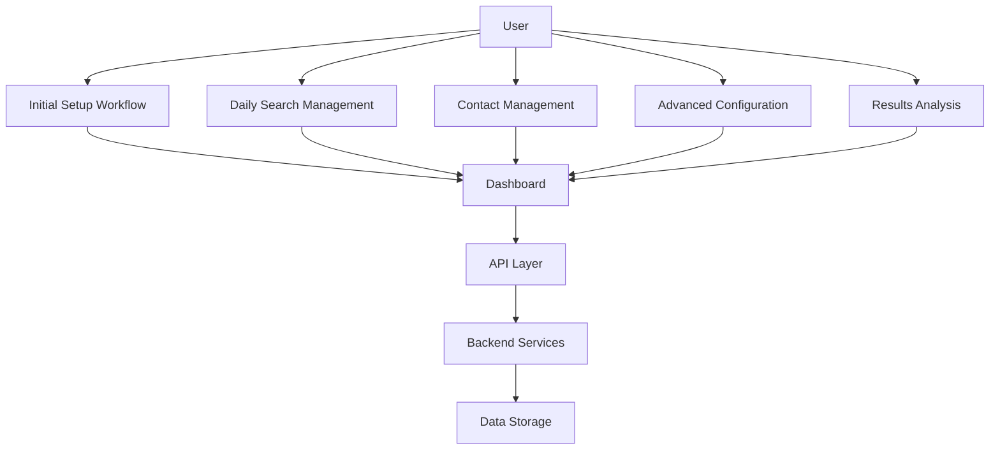
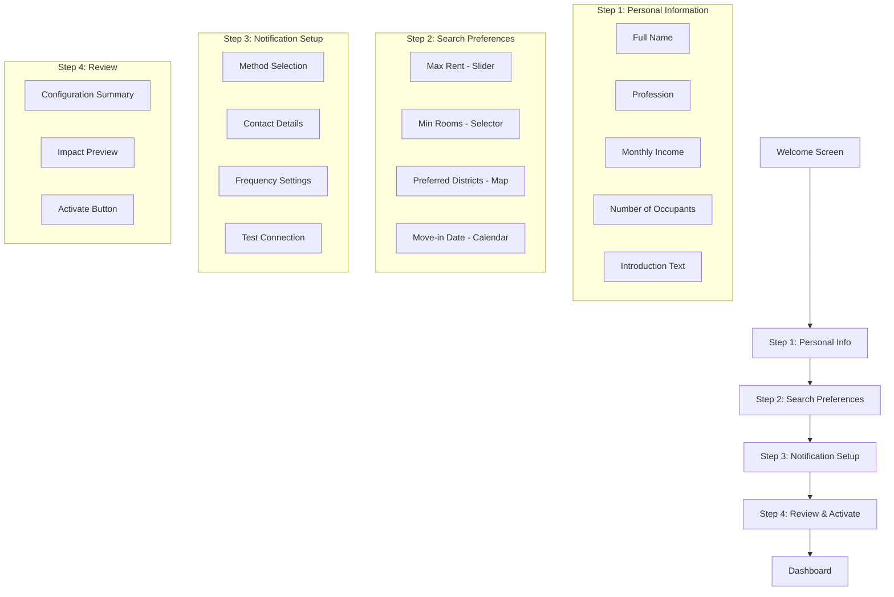
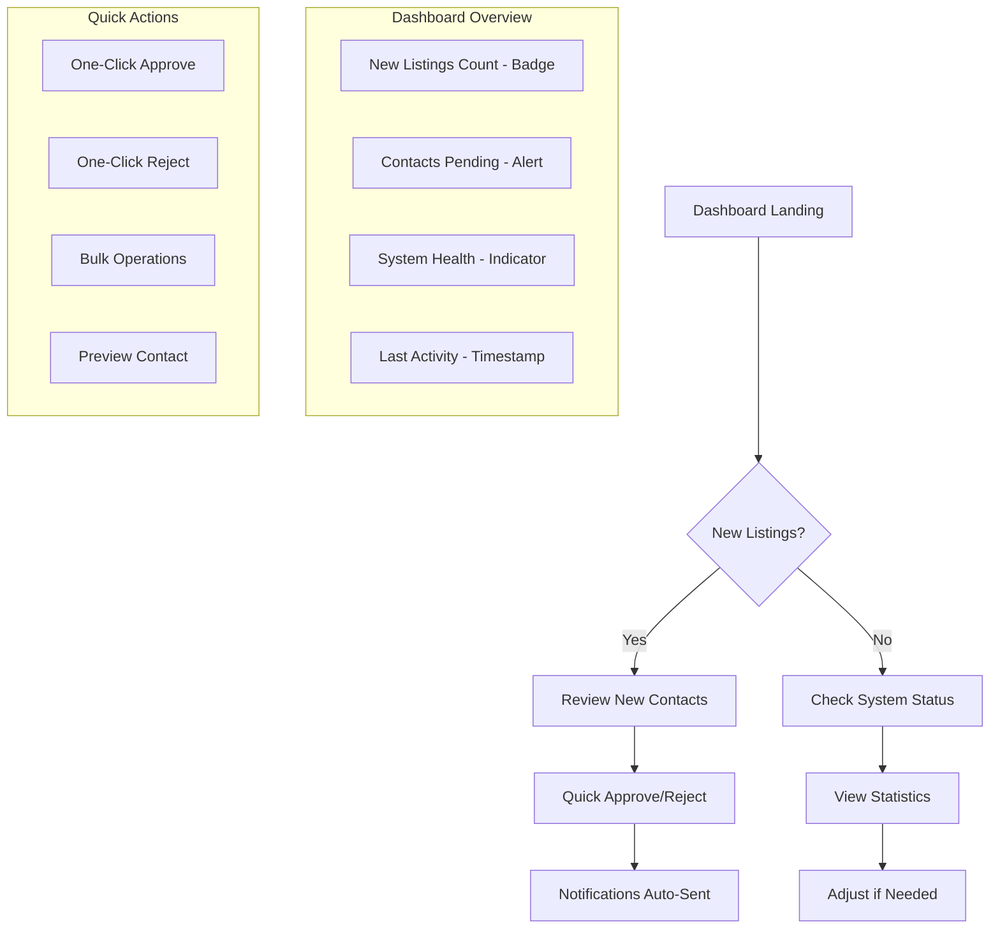
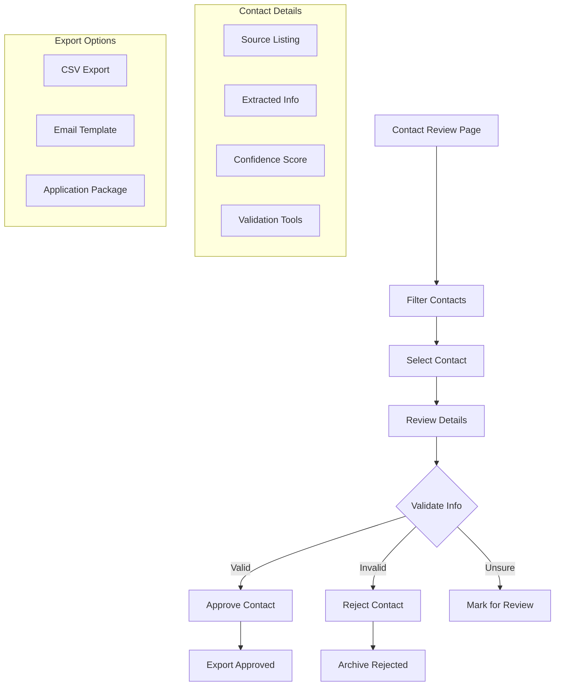
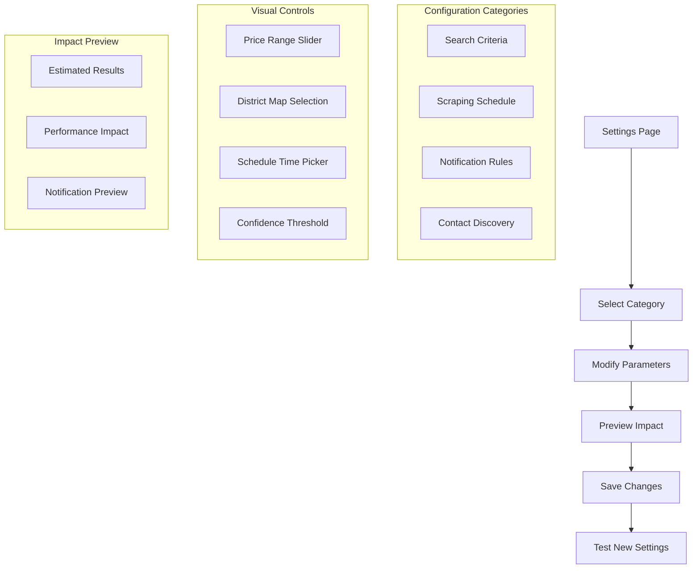
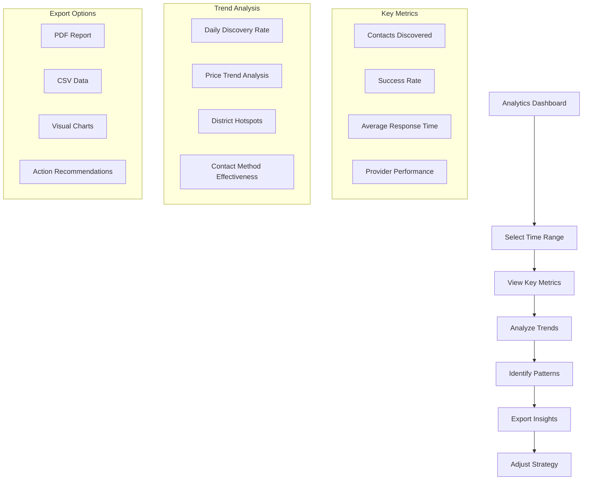
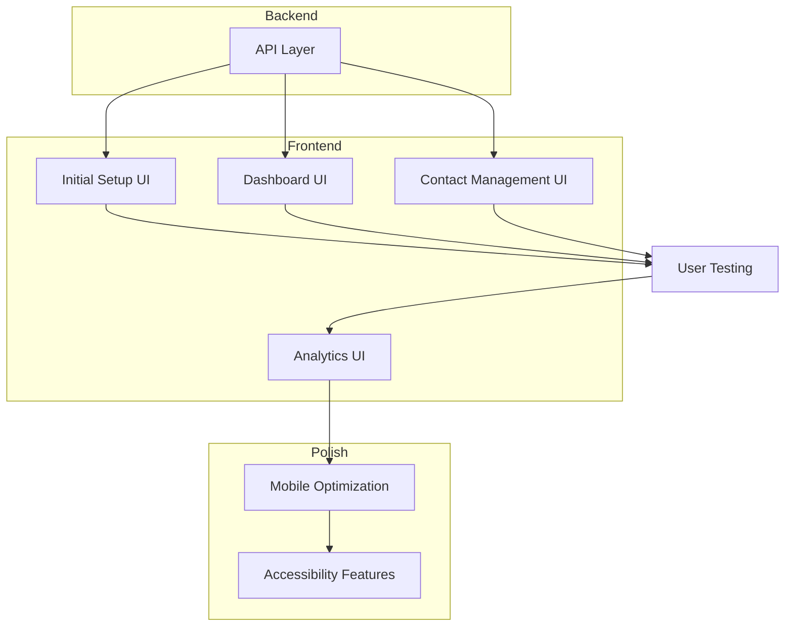

# MAFA User Workflows - Comprehensive Design Documentation

## Overview

This document provides detailed user workflow designs for the Munich Apartment Finder Assistant (MAFA) application, transforming the powerful backend functionality into intuitive, accessible user experiences for non-technical users.

## Workflow Architecture



---

## 1. Initial Setup Workflow (5-10 minutes)

### User Journey Map



### UI Mockup Description

**Welcome Screen:**
- Hero section with friendly illustration
- "Get Started in 5 Minutes" headline
- Progress indicator showing 4 steps
- "Quick Start" vs "Advanced Setup" options

**Step 1: Personal Information (2 minutes)**
- Clean form with inline validation
- Auto-save as user types
- "Why we need this" help tooltips
- Photo upload for application (optional)

**Step 2: Search Preferences (2 minutes)**
- Visual price slider with budget feedback
- Interactive Munich district map
- Room count selector with icons
- Move-in date picker with availability hints

**Step 3: Notification Setup (2 minutes)**
- Method selection cards (Discord/Telegram/Email)
- Dynamic form fields based on selection
- "Test Connection" button with instant feedback
- Frequency slider (Real-time/Daily/Weekly)

**Step 4: Review & Activate (1 minute)**
- Configuration summary cards
- Estimated search results preview
- "Activate MAFA" button with celebration animation
- Option to save configuration for later

### API Integration Requirements

**Configuration API Calls:**
```javascript
// Step 1: Save personal info
PUT /api/v1/config
{
  "section": "personal_profile",
  "updates": {
    "full_name": "string",
    "profession": "string",
    "monthly_income": number,
    "occupants": number,
    "introduction": "string"
  }
}

// Step 2: Save search preferences
PUT /api/v1/config
{
  "section": "search_criteria",
  "updates": {
    "max_price": number,
    "min_rooms": number,
    "districts": ["string"],
    "move_in_date": "date"
  }
}

// Step 3: Setup notifications
PUT /api/v1/config
{
  "section": "notification",
  "updates": {
    "provider": "discord|telegram|email",
    "webhook_url": "string",
    "frequency": "realtime|daily|weekly"
  }
}

// Step 4: Validate and activate
POST /api/v1/config/validate
POST /api/v1/scraper/start
```

### Error Handling

| Error Scenario | User-Friendly Message | Recovery Action |
|----------------|----------------------|-----------------|
| Invalid email format | "Please check your email address" | Highlight field, show example |
| Connection test fails | "We couldn't reach your notification service" | Show troubleshooting guide |
| Configuration validation fails | "Some settings need adjustment" | Highlight problematic fields |
| Scraper start fails | "MAFA needs a moment to start up" | Retry button, contact support |

### Mobile Considerations

- **Responsive Breakpoints:** Single column layout on mobile
- **Touch Targets:** Minimum 44px for all interactive elements
- **Swipe Gestures:** Swipe between setup steps
- **Keyboard Optimization:** Proper input types (email, number, tel)

### Accessibility Features

- **Screen Reader Support:** ARIA labels for all form elements
- **Keyboard Navigation:** Tab order through setup steps
- **High Contrast:** WCAG AA compliant color ratios
- **Font Scaling:** Supports 200% zoom without horizontal scroll

---

## 2. Daily Search Management Workflow (2-5 minutes)

### User Journey Map



### UI Mockup Description

**Dashboard Landing Page:**
- **Header:** "Good morning! You have 3 new listings to review"
- **Status Cards:** Large numbers with trend indicators
- **Quick Actions Panel:** Prominent buttons for common tasks
- **Recent Activity Feed:** Timeline of discoveries and actions

**New Listings Review:**
- **Card Layout:** Each listing as a card with photo, price, location
- **Contact Preview:** Extracted contacts visible on card
- **Swipe Actions:** Mobile swipe to approve/reject
- **Bulk Select:** Checkbox multi-select for batch operations

**System Status Check:**
- **Health Indicators:** Color-coded system components
- **Performance Charts:** Simple bar charts for recent activity
- **Alert Center:** Collapsible panel for warnings/errors

### API Integration Requirements

**Dashboard Data Loading:**
```javascript
// Load dashboard statistics
GET /api/v1/contacts/statistics/summary
GET /api/v1/listings/statistics/summary
GET /api/v1/system/health

// Get new listings
GET /api/v1/listings?status=new&limit=20

// Get pending contacts
GET /api/v1/contacts?status=pending&limit=50

// Quick actions
POST /api/v1/contacts/{id}/validate
PUT /api/v1/contacts/{id}
{
  "status": "approved"|"rejected"
}

// Bulk operations
POST /api/v1/contacts/bulk-update
{
  "contact_ids": [1, 2, 3],
  "status": "approved"
}
```

### Error Handling

| Error Scenario | User-Friendly Message | Recovery Action |
|----------------|----------------------|-----------------|
| Failed to load dashboard | "Having trouble loading your dashboard" | Retry button, offline mode |
| Contact approval fails | "Couldn't approve this contact" | Retry, mark for manual review |
| Bulk operation fails | "Some contacts couldn't be updated" | Show which failed, retry option |
| System health issues | "MAFA needs attention" | Link to troubleshooting guide |

### Mobile Considerations

- **Pull to Refresh:** Refresh dashboard data
- **Swipe Actions:** Swipe left to approve, right to reject
- **Floating Action Button:** Quick access to common actions
- **Offline Mode:** Cache recent data for offline viewing

### Accessibility Features

- **Live Regions:** Announce new listings to screen readers
- **Keyboard Shortcuts:** A for approve, R for reject, N for next
- **Focus Management:** Return focus to appropriate element after actions
- **Status Announcements:** "3 contacts approved" announced to screen readers

---

## 3. Contact Management Workflow (3-8 minutes)

### User Journey Map



### UI Mockup Description

**Contact Review Interface:**
- **Filter Sidebar:** Collapsible panel with filter options
- **Contact Cards:** Horizontal cards with all key information
- **Confidence Visualization:** Color-coded confidence indicators
- **Quick Actions:** Hover-activated action buttons

**Contact Detail Modal:**
- **Source Context:** Screenshot of original listing section
- **Extracted Information:** Formatted contact details
- **Validation Tools:** "Check Email" / "Verify Phone" buttons
- **Action Buttons:** Large, clear approve/reject buttons

**Export Interface:**
- **Format Selection:** Cards for CSV, Email, Application Package
- **Template Builder:** Drag-and-drop template builder
- **Preview:** Live preview of export format

### API Integration Requirements

**Contact Management API Calls:**
```javascript
// Get contacts with filtering
GET /api/v1/contacts?
  contact_type=email&
  confidence_min=0.7&
  status=pending&
  sort_by=confidence&
  sort_order=desc

// Get single contact details
GET /api/v1/contacts/{id}

// Update contact status
PUT /api/v1/contacts/{id}
{
  "status": "valid"|"invalid"|"suspicious",
  "validation_metadata": {
    "checked": true,
    "notes": "string"
  }
}

// Validate contact
POST /api/v1/contacts/{id}/validate
{
  "validation_level": "standard"|"comprehensive"
}

// Export contacts
POST /api/v1/contacts/export
{
  "format": "csv"|"xlsx",
  "filters": {
    "status": "valid",
    "confidence_min": 0.8
  },
  "include_metadata": true
}
```

### Error Handling

| Error Scenario | User-Friendly Message | Recovery Action |
|----------------|----------------------|-----------------|
| Contact details fail to load | "Couldn't load contact details" | Retry button, load basic info |
| Validation service unavailable | "Validation service is temporarily down" | Allow manual approval, queue for later |
| Export generation fails | "Couldn't generate export file" | Try different format, smaller batch |
| Bulk export timeout | "Export is taking longer than expected" | Email when ready, background processing |

### Mobile Considerations

- **Card Layout:** Vertical stack of contact cards on mobile
- **Swipe Actions:** Swipe left for approve, right for reject
- **Full-Screen Modal:** Contact details in full-screen modal
- **Touch-Friendly:** Large tap targets for validation buttons

### Accessibility Features

- **Screen Reader Tables:** Proper table headers and captions
- **Keyboard Navigation:** Arrow keys to navigate contact list
- **Focus Indicators:** Clear focus on interactive elements
- **Alternative Text:** Descriptive alt text for confidence indicators

---

## 4. Advanced Search Configuration Workflow (2-5 minutes)

### User Journey Map



### UI Mockup Description

**Settings Overview:**
- **Tabbed Interface:** Horizontal tabs for each settings category
- **Visual Indicators:** Changed settings highlighted in yellow
- **Reset Options:** "Reset to Default" for each section
- **Search Impact:** Live preview of how changes affect results

**Search Criteria Configuration:**
- **Price Range:** Dual-handle slider with budget feedback
- **District Selection:** Interactive Munich map with district boundaries
- **Room Requirements:** Plus/minus buttons with visual feedback
- **Amenities:** Toggle switches for features (balcony, parking, etc.)

**Scraping Schedule Configuration:**
- **Time Picker:** Visual clock interface for scheduling
- **Frequency Selector:** Radio buttons with custom options
- **Provider Toggles:** Enable/disable specific providers
- **Rate Limiting:** Slider for request frequency

**Notification Rules:**
- **Trigger Conditions:** "When new listing matches criteria"
- **Delivery Methods:** Priority ranking of notification methods
- **Quiet Hours:** Time range selector for notifications
- **Digest Options:** Daily/weekly summary settings

### API Integration Requirements

**Configuration Management API Calls:**
```javascript
// Get current configuration
GET /api/v1/config

// Update search criteria
PUT /api/v1/config
{
  "section": "search_criteria",
  "updates": {
    "max_price": number,
    "min_rooms": number,
    "districts": ["string"],
    "amenities": ["string"]
  }
}

// Update scraping schedule
PUT /api/v1/config
{
  "section": "scraping",
  "updates": {
    "schedule": "cron_expression",
    "enabled_providers": ["immoscout", "wg_gesucht"],
    "rate_limit_seconds": number
  }
}

// Update notification rules
PUT /api/v1/config
{
  "section": "notification",
  "updates": {
    "triggers": ["new_listing", "price_drop"],
    "delivery_priority": ["telegram", "email"],
    "quiet_hours": {
      "start": "22:00",
      "end": "08:00"
    }
  }
}

// Preview impact
POST /api/v1/config/preview-impact
{
  "proposed_changes": {
    "search_criteria": {...},
    "scraping": {...}
  }
}

// Test new configuration
POST /api/v1/scraper/test
{
  "config_overrides": {...}
}
```

### Error Handling

| Error Scenario | User-Friendly Message | Recovery Action |
|----------------|----------------------|-----------------|
| Invalid cron expression | "Please check the schedule format" | Show examples, use preset options |
| Rate limit too aggressive | "This might cause issues with providers" | Show recommended range, explain consequences |
| Configuration conflicts | "Some settings conflict with each other" | Highlight conflicts, suggest resolutions |
| Test run fails | "Test run didn't work as expected" | Show error details, suggest adjustments |

### Mobile Considerations

- **Collapsible Sections:** Accordion-style settings categories
- **Simplified Sliders:** Larger touch targets for range controls
- **Preset Options:** Quick-select buttons for common configurations
- **Swipe to Save:** Swipe up gesture to save changes

### Accessibility Features

- **ARIA Live Regions:** Announce configuration changes
- **High Contrast Mode:** Enhanced visibility for controls
- **Keyboard Shortcuts:** Ctrl+S to save, Esc to cancel
- **Screen Reader Labels:** Detailed descriptions for complex controls

---

## 5. Results Analysis Workflow (3-5 minutes)

### User Journey Map



### UI Mockup Description

**Analytics Dashboard:**
- **Time Range Selector:** Preset buttons (7d, 30d, 90d) + custom range
- **Metric Cards:** Large numbers with trend arrows and percentages
- **Interactive Charts:** Clickable chart elements for drill-down
- **Comparison Mode:** Side-by-side period comparison

**Trend Analysis Interface:**
- **Line Charts:** Contact discovery over time
- **Heat Maps:** District activity by time of day
- **Bar Charts:** Provider performance comparison
- **Scatter Plots:** Price vs. response rate correlation

**Insights Panel:**
- **Automated Insights:** AI-generated observations
- **Pattern Recognition:** "Most contacts found on weekdays"
- **Recommendations:** "Consider expanding to district X"
- **Success Stories:** Examples of successful applications

**Export Interface:**
- **Report Builder:** Drag-and-drop chart selection
- **Template Gallery:** Pre-designed report templates
- **Schedule Exports:** Automated weekly/monthly reports
- **Sharing Options:** Email, Slack, Google Drive integration

### API Integration Requirements

**Analytics and Reporting API Calls:**
```javascript
// Get comprehensive statistics
GET /api/v1/contacts/statistics/summary
GET /api/v1/listings/statistics/summary
GET /api/v1/scraper/statistics

// Get trend data
GET /api/v1/contacts/trends?
  metric=discovery_rate&
  time_range=30d&
  group_by=day

GET /api/v1/listings/trends?
  metric=price_distribution&
  time_range=90d&
  group_by=week

// Get provider performance
GET /api/v1/scraper/providers?
  include_stats=true&
  time_range=30d

// Generate insights
POST /api/v1/analytics/generate-insights
{
  "time_range": "30d",
  "focus_areas": ["contact_discovery", "provider_performance"]
}

// Export analytics
POST /api/v1/analytics/export
{
  "format": "pdf"|"csv"|"xlsx",
  "include_charts": true,
  "time_range": "30d",
  "sections": ["summary", "trends", "recommendations"]
}
```

### Error Handling

| Error Scenario | User-Friendly Message | Recovery Action |
|----------------|----------------------|-----------------|
| Data unavailable for time range | "We don't have enough data for this period" | Suggest available ranges, show partial data |
| Chart rendering fails | "Having trouble displaying this chart" | Show table view, allow download |
| Export generation timeout | "Report is taking longer than expected" | Email when ready, background processing |
| Analytics service error | "Insights service is temporarily unavailable" | Show basic stats, retry automatically |

### Mobile Considerations

- **Swipe Navigation:** Swipe between different chart views
- **Touch Interactions:** Pinch to zoom on charts, tap for details
- **Simplified Charts:** Mobile-optimized chart versions
- **Offline Caching:** Cache recent analytics for offline viewing

### Accessibility Features

- **Chart Alternatives:** Data tables for all visualizations
- **Screen Reader Support:** Detailed descriptions of chart trends
- **Keyboard Navigation:** Arrow keys to navigate between data points
- **High Contrast Charts:** Patterns and textures in addition to colors

---

## Implementation Priority Recommendations

### Phase 1: Core Workflows (MVP)
1. **Initial Setup Workflow** - Essential for user onboarding
2. **Daily Search Management** - Primary user interaction
3. **Basic Contact Management** - Core functionality

### Phase 2: Enhanced Features
4. **Advanced Search Configuration** - Power user features
5. **Results Analysis** - Value-added insights
6. **Mobile Optimization** - Responsive design improvements

### Phase 3: Polish & Accessibility
7. **Accessibility Features** - WCAG compliance
8. **Performance Optimization** - Caching, lazy loading
9. **User Feedback Integration** - Analytics, user testing

### Technical Implementation Order



---

## Success Metrics

### User Experience Metrics
- **Setup Completion Rate:** >85% of users complete initial setup
- **Daily Active Usage:** >60% of users check dashboard daily
- **Contact Approval Rate:** >70% of suggested contacts approved
- **Time to First Success:** <7 days from setup to first application

### Technical Performance Metrics
- **API Response Time:** <200ms for dashboard loads
- **Scraper Success Rate:** >95% successful scraping runs
- **Contact Discovery Accuracy:** >80% valid contacts discovered
- **System Uptime:** >99% availability

### Business Impact Metrics
- **User Retention:** >70% after 30 days
- **Application Success Rate:** >20% of contacts lead to applications
- **Time Savings:** >5 hours/week vs manual searching
- **User Satisfaction:** >4.5/5 average rating

---

## Conclusion

These comprehensive user workflows transform MAFA's powerful backend capabilities into intuitive, accessible experiences for non-technical users. By focusing on progressive disclosure, visual feedback, and one-click actions, users can effectively find apartments without understanding the complex technical implementation.

The modular design allows for iterative development, starting with core workflows and progressively adding advanced features based on user feedback and usage patterns.