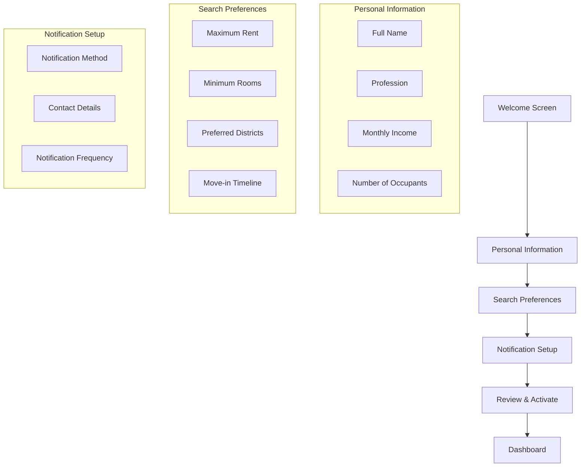
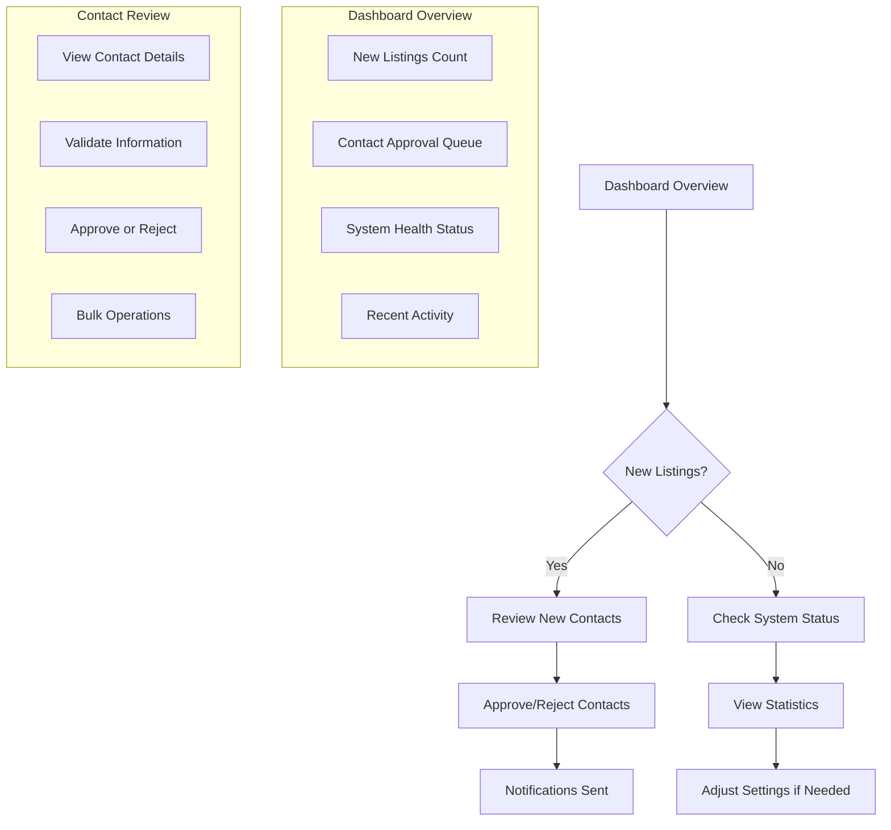
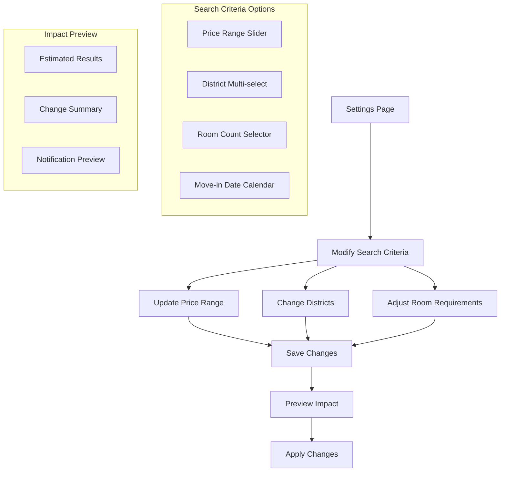
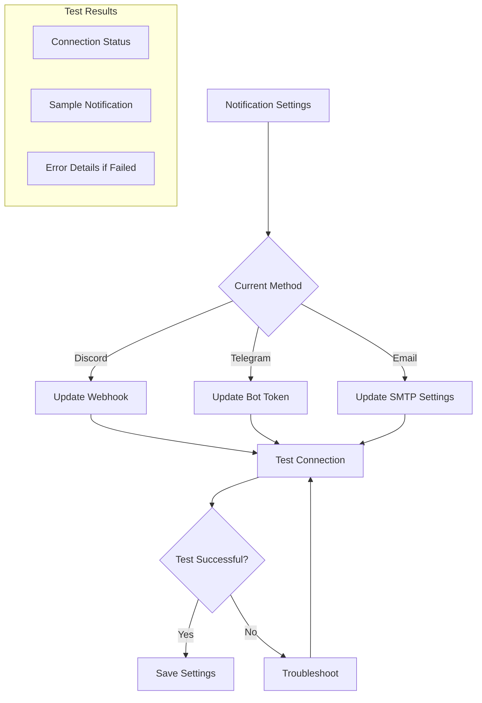

# MAFA User Flow Recommendations

Based on the architecture analysis, here are the recommended user flows for making MAFA accessible to non-technical users.

## Essential User Workflows

### 1. Initial Setup Flow (First-Time User)

**Key Features:**
- Step-by-step wizard interface
- Progress indicator
- Validation at each step
- Ability to go back and modify
- "Quick Start" option with sensible defaults
- Preview of configuration before activation

**User Actions Required:**
1. Enter personal details (5 fields)
2. Set search criteria (4 fields)
3. Choose notification method (2-3 fields)
4. Review and confirm setup

**Time Estimate:** 5-10 minutes for initial setup

---

### 2. Daily Monitoring Flow (Active User)

**Key Features:**
- Real-time updates via WebSocket
- Visual indicators for new content
- One-click approval/rejection
- Bulk operations for efficiency
- Automated notifications after approval

**User Actions Required:**
1. Check dashboard (daily, 1-2 minutes)
2. Review new contacts (as needed, 5-10 minutes)
3. Approve/reject contacts (as needed, 1-2 minutes per contact)

**Time Estimate:** 5-15 minutes daily

---

### 3. Search Management Flow (Adjusting Preferences)

**Key Features:**
- Visual feedback for changes
- Impact preview before applying
- Save as preset options
- Immediate or scheduled application
- Rollback capability

**User Actions Required:**
1. Access settings (1 click)
2. Modify criteria (varies)
3. Preview changes (automatic)
4. Apply or schedule (1 click)

**Time Estimate:** 2-5 minutes for adjustments

---

### 4. Notification Management Flow (Communication Preferences)

**Key Features:**
- Connection testing before saving
- Sample notification preview
- Troubleshooting guidance
- Multiple notification methods
- Frequency customization

**User Actions Required:**
1. Select notification method (1 click)
2. Enter credentials (varies)
3. Test connection (1 click)
4. Save if successful (1 click)

**Time Estimate:** 3-8 minutes for setup

---

## User Interface Components

### Dashboard Components
1. **Status Overview Card**
   - System health indicator
   - New listings count
   - Contacts pending review
   - Last successful scrape

2. **Quick Actions Panel**
   - "Start Manual Scrape"
   - "Review New Contacts"
   - "Export Data"
   - "Adjust Settings"

3. **Recent Activity Feed**
   - New listings discovered
   - Contacts extracted
   - Notifications sent
   - System events

### Contact Review Interface
1. **Contact Cards**
   - Source information
   - Contact method (email/phone/form)
   - Confidence score visualization
   - Quick approve/reject buttons

2. **Bulk Operations**
   - Select multiple contacts
   - Bulk approve/reject
   - Export selected contacts

3. **Contact Details Modal**
   - Full context information
   - Validation status
   - Discovery path
   - Manual verification tools

### Settings Interface
1. **Tabbed Organization**
   - Personal Information
   - Search Criteria
   - Notifications
   - Advanced Options

2. **Visual Controls**
   - Sliders for price ranges
   - Map for district selection
   - Calendar for move-in dates
   - Toggle switches for features

---

## Simplified Configuration Mapping

### Complex Backend → Simple Frontend

| Backend Configuration | Frontend Simplification |
|----------------------|------------------------|
| `personal_profile.*` | "About You" form with 5 fields |
| `search_criteria.*` | "What You're Looking For" with visual controls |
| `notification.provider` | "How to Reach You" with method selection |
| `scrapers[]` | "Where to Search" with checkboxes |
| `contact_discovery.*` | "Contact Finding" with confidence slider |
| `storage.*` | "Data Management" with retention settings |

### API Endpoints to User Actions

| User Action | API Endpoint(s) | Frontend Simplification |
|-------------|----------------|------------------------|
| Setup profile | `POST /api/v1/config` | Multi-step wizard |
| View listings | `GET /api/v1/listings` | Infinite scroll feed |
| Review contacts | `GET /api/v1/contacts` | Card-based interface |
| Approve contact | `PUT /api/v1/contacts/{id}` | One-click approval |
| Start scrape | `POST /api/v1/scraper/start` | "Search Now" button |
| Check status | `GET /api/v1/system/health` | Real-time indicators |

---

## Mobile-First Design Considerations

### Responsive Breakpoints
- **Mobile (< 768px)**: Single column, swipe gestures
- **Tablet (768px - 1024px)**: Two column layout
- **Desktop (> 1024px)**: Full dashboard layout

### Touch-Friendly Elements
- Large tap targets (44px minimum)
- Swipe actions for approve/reject
- Pull-to-refresh functionality
- Haptic feedback for actions

### Progressive Enhancement
1. **Core Functionality**: Works without JavaScript
2. **Enhanced Experience**: Real-time updates with WebSocket
3. **Advanced Features**: Bulk operations, detailed analytics

---

## User Onboarding Strategy

### Day 1: Quick Start
1. **5-minute setup wizard**
2. **Immediate first scrape**
3. **First contact discovery**
4. **Dashboard tour**

### Week 1: Learning Phase
1. **Daily email summaries**
2. **In-app tips and guidance**
3. **Progressive feature discovery**
4. **First contact approval**

### Ongoing: Optimization
1. **Weekly performance reports**
2. **Smart suggestions for improvements**
3. **Seasonal adjustment reminders**
4. **Success metrics tracking**

---

## Accessibility Features

### Visual Accessibility
- High contrast mode
- Font size adjustment
- Screen reader support
- Color-blind friendly palettes

### Motor Accessibility
- Keyboard navigation
- Voice commands
- Switch control support
- Reduced motion options

### Cognitive Accessibility
- Simple language throughout
- Clear visual hierarchy
- Consistent navigation patterns
- Error prevention and recovery

This user flow design transforms the complex MAFA backend into an intuitive, accessible interface that allows users to find apartments without understanding the technical implementation.