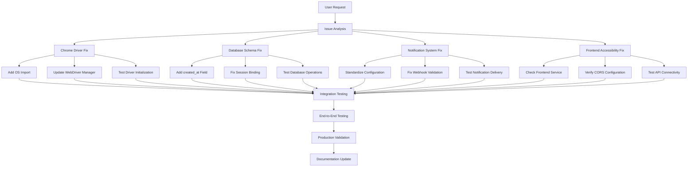

# MWA Fix Workflow Architecture

## System Architecture Overview



## Priority Execution Order

### Phase 1: Critical Infrastructure (Hours 1-4)
1. **Chrome Driver Fix** - Blocking all scraping functionality
   - Fix missing `os` import in [`mafa/driver.py`](mafa/driver.py)
   - Update WebDriver Manager compatibility
   - Test basic driver functionality

2. **Frontend Accessibility** - Blocking user interface
   - Investigate port 5173 accessibility
   - Check frontend service status
   - Verify CORS configuration

### Phase 2: Core Functionality (Hours 5-8)
3. **Database Schema** - Affecting data persistence
   - Add `created_at` field to ScrapingRun model
   - Fix session binding issues
   - Test database operations

4. **Notification System** - Secondary functionality
   - Standardize configuration format
   - Fix webhook validation
   - Test notification delivery

### Phase 3: Scraping Optimization (Hours 9-12)
5. **Selector Updates** - Improving scraping success
   - Update CSS selectors for current website structures
   - Implement robust waiting strategies
   - Add fallback mechanisms

## Testing Strategy

### Unit Tests
```python
# Chrome Driver Test
def test_chrome_driver_initialization():
    with SeleniumDriver() as driver:
        assert driver is not None
        driver.get("https://example.com")
        assert "Example" in driver.title

# Database Test  
def test_scraping_run_creation():
    run = ScrapingRun(provider="test", status=JobStatus.PENDING)
    session.add(run)
    session.commit()
    assert run.id is not None
    assert run.created_at is not None

# Notification Test
def test_discord_notifier():
    notifier = DiscordNotifier(config)
    result = notifier.test_webhook()
    assert result is True
```

### Integration Tests
```python
# End-to-End Scraping Test
def test_complete_scraping_flow():
    # Start scraping job
    # Verify data persistence
    # Check notification delivery
    # Validate frontend display
```

## Risk Mitigation

### High Risk Areas
- **WebDriver Manager API Changes**: Maintain compatibility matrix
- **Website Structure Changes**: Implement selector versioning
- **Database Schema Updates**: Use migration scripts with rollback

### Monitoring Points
- Chrome driver initialization success rate
- Database operation error rates
- Notification delivery success rate
- Frontend API response times

## Success Metrics

| Component | Success Criteria | Measurement |
|-----------|------------------|-------------|
| Chrome Driver | 100% initialization success | Test runs without errors |
| Database | All CRUD operations work | No schema errors |
| Notifications | Webhook test passes | Mock delivery successful |
| Frontend | Accessible on port 5173 | HTTP 200 response |
| Scraping | >80% success rate | Listings extracted successfully |

## Implementation Checklist

### Chrome Driver Fix
- [ ] Add `import os` to [`mafa/driver.py`](mafa/driver.py)
- [ ] Remove `ChromeType` import
- [ ] Update WebDriver Manager usage
- [ ] Test driver initialization
- [ ] Verify basic navigation

### Database Schema
- [ ] Add `created_at` field to ScrapingRun
- [ ] Update migration scripts
- [ ] Test model operations
- [ ] Verify session binding

### Notification System
- [ ] Standardize configuration format
- [ ] Fix webhook validation
- [ ] Test notification delivery
- [ ] Update error handling

### Frontend Accessibility
- [ ] Check frontend service status
- [ ] Verify port binding
- [ ] Test CORS configuration
- [ ] Validate API connectivity

This workflow provides a structured approach to resolving all critical issues in the MWA application.