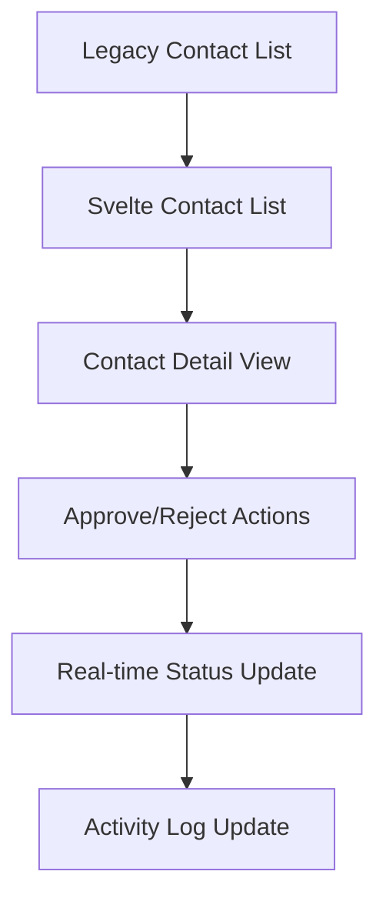

# Phase 3: Feature-by-Feature Migration Implementation Plan

## Current State Analysis

### ✅ Already Implemented in Svelte/SvelteKit
- **Dashboard Overview**: Basic stats, quick actions, recent activity
- **Contact Management**: List view, search, pagination, contact details navigation
- **Analytics**: Agency type distribution, market area analysis, monthly trends
- **API Integration**: Complete API client with error handling and retry logic
- **WebSocket Service**: Real-time connection management with reconnection logic
- **Mobile-First Design**: Responsive layout with mobile navigation

### ⚠️ Migration Gaps Identified

**1. Contact Management Features Missing**
- Contact approval/rejection functionality
- Bulk operations (approve/reject multiple contacts)
- Contact export functionality
- Contact creation/editing forms

**2. Search Management Features Missing**
- Advanced search filters
- Search criteria management
- Search history and saved searches

**3. Real-time Features Missing**
- Live contact updates
- System status monitoring
- Real-time notifications

**4. System Status Features Missing**
- Service health monitoring
- Performance metrics dashboard
- Error tracking and logging

## Migration Implementation Strategy

### Phase 3A: Contact Management Migration (Priority: HIGH)

#### 3A.1: Contact Approval/Rejection Workflow

**Implementation Tasks:**
- Add approve/reject buttons to contact detail view
- Implement status change API integration
- Add real-time status updates via WebSocket
- Update activity log with approval/rejection events

#### 3A.2: Bulk Operations
- Implement bulk selection UI in contact list
- Add bulk approve/reject API integration
- Add progress tracking for bulk operations
- Implement error handling for partial failures

#### 3A.3: Export Functionality
- Add export button to contact management
- Implement export API integration
- Add export format selection (CSV, JSON, PDF)
- Add export status tracking

### Phase 3B: Search Management Migration (Priority: MEDIUM)

#### 3B.1: Advanced Search Filters
- Implement filter component with multiple criteria
- Add search history persistence
- Implement saved searches functionality
- Add search result pagination and sorting

#### 3B.2: Search Criteria Management
- Create search criteria builder component
- Implement criteria validation
- Add search template saving/loading
- Implement search performance optimization

### Phase 3C: Real-time Features Migration (Priority: HIGH)

#### 3C.1: Live Updates Integration
- Enhance WebSocket service for contact updates
- Implement real-time contact list updates
- Add live notification system
- Implement connection status monitoring

#### 3C.2: System Status Dashboard
- Create system health monitoring component
- Implement service status indicators
- Add performance metrics display
- Implement error tracking and alerting

## Migration Validation Strategy

### Validation Gates for Each Feature

**Gate 3A: Contact Management Validation**
- [ ] All contact CRUD operations functional
- [ ] Approval/rejection workflow working
- [ ] Bulk operations performant (< 5s for 100 contacts)
- [ ] Export functionality complete
- [ ] Real-time updates working

**Gate 3B: Search Management Validation**
- [ ] Advanced search filters functional
- [ ] Search performance acceptable (< 2s response time)
- [ ] Saved searches working
- [ ] Search history persistent

**Gate 3C: Real-time Features Validation**
- [ ] WebSocket connection stable
- [ ] Real-time updates reliable
- [ ] System status monitoring accurate
- [ ] Error handling robust

## Risk Assessment & Mitigation

### High-Risk Areas

**1. Data Consistency During Migration**
- **Risk**: Data loss or corruption during contact status changes
- **Mitigation**: Implement dual-write pattern, validate data consistency

**2. Real-time Connection Stability**
- **Risk**: WebSocket connection drops causing missed updates
- **Mitigation**: Implement connection monitoring, automatic reconnection

**3. Performance Degradation**
- **Risk**: Bulk operations slow down system
- **Mitigation**: Implement progressive loading, background processing

### Rollback Procedures

**Feature-level Rollback (5 minutes)**
- Toggle feature flags to disable new functionality
- Redirect users to legacy dashboard for affected features

**Component-level Rollback (15 minutes)**
- Rollback Svelte components to previous version
- Restore API endpoints to legacy implementation

## Implementation Timeline

### Week 1: Contact Management Core
- Contact approval/rejection workflow
- Basic bulk operations
- Export functionality foundation

### Week 2: Search Management
- Advanced search filters
- Search criteria management
- Performance optimization

### Week 3: Real-time Features
- Enhanced WebSocket integration
- System status dashboard
- Real-time notifications

### Week 4: Integration & Testing
- End-to-end testing
- Performance validation
- User acceptance testing

## Success Metrics

**Performance Targets:**
- Contact list load time: < 2 seconds
- Search response time: < 1 second
- Bulk operation completion: < 5 seconds (100 contacts)
- WebSocket reconnection: < 3 seconds

**Quality Targets:**
- Test coverage: > 90%
- Error rate: < 1%
- User satisfaction: > 4/5 rating

## Next Steps

1. **Immediate**: Begin Phase 3A implementation (Contact Management)
2. **Parallel**: Update validation framework with Phase 3-specific tests
3. **Continuous**: Monitor legacy system performance during migration
4. **Validation**: Conduct weekly migration progress reviews

**Status**: READY_FOR_PHASE_3_IMPLEMENTATION