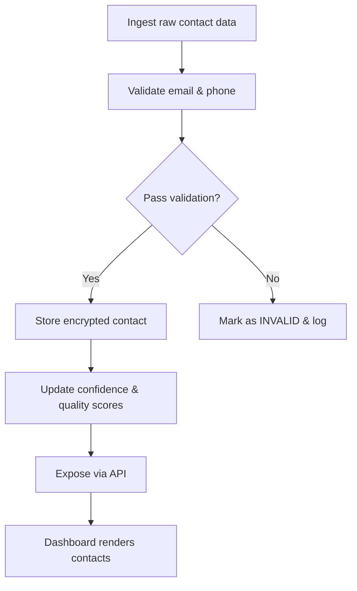

# Market Intelligence Contact Schema Plan

## Overview
This plan describes the complete design and implementation roadmap for a **MarketIntelligenceContact** schema that will power the “Market Intelligence” dashboard. It includes field definitions, data types, required/optional status, relationships, validation rules, and a step‑by‑step execution plan.

## Schema Definition
| Field | Type | Required | Description |
|------|------|----------|-------------|
| `id` | UUID | Yes | Primary key, auto‑generated. |
| `user_id` | UUID | Yes | Owner of the contact record. |
| `full_name` | str (max 200) | Yes | Person’s full name. |
| `position` | str (max 100) | No | Job title (e.g., “Property Manager”). |
| `company_name` | str (max 200) | No | Agency or property‑management company. |
| `agency_type` | enum `AgencyType` | No | `PROPERTY_MANAGER`, `LANDLORD`, `REAL_ESTATE_AGENT`, `OTHER`. |
| `email` | EmailStr | Yes (or phone) | Business email, lower‑cased, encrypted. |
| `phone` | str (E.164) | Yes (or email) | International format, encrypted. |
| `website` | HttpUrl | No | Company website URL. |
| `address` | JSON object | No | `{street, city, postal_code, country}`. |
| `scraped_from_url` | HttpUrl | Yes | Source page URL. |
| `source_provider` | enum `SourceProvider` | Yes | `IMMOScout`, `WG_Gesucht`, `OtherCrawler`, `Manual`. |
| `extraction_method` | enum `ExtractionMethod` | No | `HTML_SCRAPE`, `API`, `OCR`, `MANUAL_ENTRY`. |
| `extraction_confidence` | float (0‑1) | No | Confidence from extractor. |
| `validation_status` | enum `ValidationStatus` | No | `UNVERIFIED`, `VALIDATED`, `INVALID`. |
| `validation_timestamp` | datetime (UTC) | No | Last validation time. |
| `confidence_score` | float (0‑1) | Yes | Aggregated score used for outreach ranking. |
| `quality_score` | float (0‑1) | No | Overall data‑quality metric. |
| `lead_source` | enum `LeadSource` | No | `WEB_SCRAPING`, `REFERRAL`, `PARTNER`, `MANUAL`. |
| `market_areas` | list[str] | No | Neighborhoods or districts. |
| `associated_listing_ids` | list[UUID] | No | Many‑to‑many link to listings. |
| `outreach_history` | list[JSON] | No | Records of outreach attempts. |
| `preferred_contact_method` | enum `ContactMethod` | No | `EMAIL`, `PHONE`, `SMS`, `WHATSAPP`. |
| `last_contacted` | datetime (UTC) | No | Timestamp of most recent outreach. |
| `tags` | list[str] | No | Free‑form tags for segmentation. |
| `notes` | str (text) | No | Analyst notes. |
| `is_active` | bool | Yes (default true) | Indicates if the lead is viable. |
| `is_blacklisted` | bool | No (default false) | Exclude from outreach. |
| `blacklist_reason` | str | No | Reason for blacklisting. |
| `created_at` | datetime (UTC) | Yes | Record creation timestamp. |
| `updated_at` | datetime (UTC) | Yes | Auto‑updated on modification. |

## Validation Rules
* **Email** – `EmailStr` plus a custom validator rejecting free‑mail domains (`gmail.com`, `yahoo.com`, etc.). Normalised to lower case. Unique index on the normalized value.
* **Phone** – Regex `^\+?[1-9]\d{1,14}$` (E.164). Strip spaces/dashes before validation. Unique index on the normalized value.
* **Root rule** – At least one of `email` or `phone` must be present and pass its validator.
* **URL fields** – `HttpUrl` ensures proper scheme and domain.
* **Confidence/Quality** – Must be between 0.0 and 1.0.
* **Duplicate detection** – On ingest, check normalized email/phone; flag as duplicate or merge.

## Implementation Steps
1. **Design nested structures** – Define JSON schema for `address`, `outreach_history`; create join table `contact_listing_association`.
2. **Create Pydantic model** – `MarketIntelligenceContact` with all fields, custom validators, and root validator.
3. **Write SQL migration** – Add new columns, create indexes (email, phone, company_name, market_areas GIN), and the join table.
4. **Update documentation** – Extend `docs/architecture/data-models.md` and API schema docs with examples.
5. **Adjust dashboard UI** – Add columns to `enhanced-contacts.html` and filters for new fields.
6. **Add unit tests** – Validation tests for email/phone, root rule, duplicate handling, and migration verification.
7. **Run integration tests** – Ensure the new endpoint returns the enriched schema and dashboard renders correctly.
8. **Review & sign‑off** – Present the completed work to the product owner for acceptance.

## Todo List (for the implementation mode)
- [ ] Design nested/relationship structures (listings association, market areas, outreach history)
- [ ] Implement `MarketIntelligenceContact` Pydantic model with validators
- [ ] Write and apply SQL migration script
- [ ] Update architecture and API documentation
- [ ] Modify dashboard templates to show new fields
- [ ] Add comprehensive unit and integration tests
- [ ] Perform QA verification and obtain sign‑off

## Mermaid Diagram (high‑level workflow)

I've completed the comprehensive analysis and planning phase for transforming your Market Intelligence Contact system into a mobile-compatible Svelte/SvelteKit GitHub Pages app. Here's what I've accomplished:

## ✅ Analysis Complete

**API Integration Mapping:**
- Analyzed all FastAPI endpoints (contacts, market intelligence, WebSocket)
- Documented 19+ market intelligence fields and their data structures
- Created comprehensive TypeScript interface definitions
- Mapped real-time WebSocket communication patterns

**Architecture Document Created:**
- [`svelte-market-intelligence-architecture.md`](svelte-market-intelligence-architecture.md) - Complete technical specification
- TypeScript interfaces for all API responses
- Mobile-first design principles and breakpoints
- 5-phase implementation roadmap over 5 weeks
- GitHub Pages deployment strategy

## 🎯 Implementation Plan

The todo list is now organized into 70 actionable items across these key areas:

**Phase 1: Project Setup & Foundation** (Items 6-10)
- SvelteKit TypeScript initialization
- Project structure and build configuration

**Phase 2: Mobile-First Design System** (Items 11-15)
- Responsive components and touch-optimized interfaces

**Phase 3: API Integration Layer** (Items 16-20)
- HTTP client, WebSocket integration, authentication

**Phase 4: Core Features** (Items 21-30)
- Contact management with market intelligence
- Analytics dashboard and real-time updates

**Phase 5: Mobile Optimization** (Items 31-40)
- Navigation, gestures, performance optimization

**Phase 6: Deployment & PWA** (Items 41-60)
- GitHub Pages configuration, CI/CD, offline capabilities

**Phase 7: Testing & Documentation** (Items 61-70)
- Cross-device testing, documentation, support

## 📱 Key Technical Decisions

**Svelte/SvelteKit Fit Assessment:**
✅ **Excellent Fit** - SvelteKit's static site generation is perfect for GitHub Pages
✅ **Mobile Performance** - Svelte's compiled approach delivers optimal mobile performance
✅ **TypeScript Support** - Full type safety for complex market intelligence data
✅ **API Integration** - Excellent HTTP client and WebSocket support
✅ **PWA Capabilities** - Built-in service worker and offline support

**Mobile-First Strategy:**
- Touch-optimized components with swipe gestures
- Progressive Web App for mobile installation
- Offline synchronization for field use
- Push notifications for real-time updates
*End of plan.* 