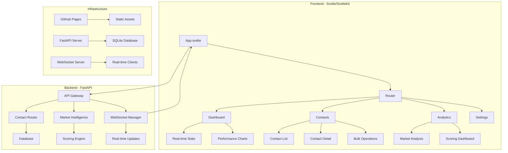

# Svelte Market Intelligence App Architecture Plan

## Executive Summary

This document outlines the comprehensive plan for transforming the existing Market Intelligence Contact system into a mobile-compatible Svelte/SvelteKit application deployed on GitHub Pages. The app will connect to the existing FastAPI backend while providing a modern, responsive user experience.

## Current System Analysis

### Existing FastAPI Backend
- **API Base URL**: `/api/v1`
- **WebSocket Support**: Real-time updates via `/api/v1/websocket`
- **CORS Configuration**: Already configured for localhost:3000 (Svelte dev server)
- **Authentication**: JWT-based with WebSocket token support

### Key API Endpoints Identified

#### Contact Management
- `GET /api/v1/contacts` - List contacts with filtering
- `GET /api/v1/contacts/{id}` - Get specific contact
- `POST /api/v1/contacts` - Create new contact
- `PUT /api/v1/contacts/{id}` - Update contact
- `DELETE /api/v1/contacts/{id}` - Delete contact
- `POST /api/v1/contacts/search` - Advanced search
- `GET /api/v1/contacts/statistics/summary` - Contact statistics

#### Market Intelligence Features
- Enhanced contact models with business intelligence fields
- Agency type classification (property_manager, landlord, real_estate_agent)
- Market area analysis and geographic targeting
- Outreach history tracking with engagement scoring
- Confidence and quality scoring (0.0-1.0)

#### WebSocket Real-time Updates
- Contact discovery notifications
- Dashboard statistics updates
- System status changes
- Scraper progress updates

## TypeScript Interface Definitions

```typescript
// Core Contact Types
interface ContactType {
  email: 'email';
  phone: 'phone';
  form: 'form';
  social_media: 'social_media';
  other: 'other';
}

interface ContactStatus {
  unvalidated: 'unvalidated';
  valid: 'valid';
  invalid: 'invalid';
  suspicious: 'suspicious';
}

// Market Intelligence Enums
enum AgencyType {
  PROPERTY_MANAGER = 'property_manager',
  LANDLORD = 'landlord',
  REAL_ESTATE_AGENT = 'real_estate_agent',
  OTHER = 'other'
}

enum SourceProvider {
  IMMOSCOUT = 'immoscout',
  WG_GESUCHT = 'wg_gesucht',
  OTHER_CRAWLER = 'other_crawler',
  MANUAL = 'manual'
}

enum ContactMethod {
  EMAIL = 'email',
  PHONE = 'phone',
  SMS = 'sms',
  WHATSAPP = 'whatsapp'
}

// Core Contact Interface
interface Contact {
  id: number;
  listing_id?: number;
  type: ContactType;
  value: string;
  confidence: number;
  source: string;
  status: ContactStatus;
  validated_at?: string;
  created_at: string;
  updated_at: string;
  validation_metadata: Record<string, any>;
}

// Market Intelligence Contact Interface
interface MarketIntelligenceContact extends Contact {
  position?: string;
  company_name?: string;
  agency_type?: AgencyType;
  market_areas: string[];
  outreach_history: OutreachHistoryEntry[];
  preferred_contact_method?: ContactMethod;
  last_contacted?: string;
  confidence_score?: number;
  quality_score?: number;
  is_active: boolean;
  is_blacklisted: boolean;
  blacklist_reason?: string;
  scraped_from_url?: string;
  source_provider?: string;
  extraction_method?: string;
  extraction_confidence?: number;
  lead_source?: string;
  tags: string[];
  notes?: string;
}

interface OutreachHistoryEntry {
  outreach_id: string;
  method: ContactMethod;
  timestamp: string;
  status: string;
  response?: string;
  notes?: string;
}

// API Response Types
interface PaginatedResponse<T> {
  data: T[];
  total: number;
  page: number;
  limit: number;
  has_next: boolean;
  has_prev: boolean;
}

interface ContactSearchRequest {
  query?: string;
  contact_type?: ContactType;
  status?: ContactStatus;
  confidence_min?: number;
  confidence_max?: number;
  listing_id?: number;
  date_from?: string;
  date_to?: string;
  limit?: number;
  offset?: number;
  sort_by?: string;
  sort_order?: 'asc' | 'desc';
}

interface MarketIntelligenceContactFilter {
  agency_type?: AgencyType;
  source_provider?: SourceProvider;
  lead_source?: string;
  market_areas?: string[];
  preferred_contact_method?: ContactMethod;
  is_active?: boolean;
  is_blacklisted?: boolean;
  has_outreach_history?: boolean;
  last_contacted_from?: string;
  last_contacted_to?: string;
  quality_score_min?: number;
  quality_score_max?: number;
}

// WebSocket Message Types
interface WebSocketMessage {
  id: string;
  type: string;
  data: any;
  sender_id?: string;
  room?: string;
  timestamp: string;
}

interface DashboardStats {
  active_searches: number;
  new_contacts_today: number;
  pending_review: number;
  success_rate: number;
  searches_trend: TrendData;
  contacts_trend: TrendData;
  pending_trend: TrendData;
  success_trend: TrendData;
}

interface TrendData {
  direction: 'up' | 'down' | 'stable';
  value: number;
  text: string;
}
```

## Technical Architecture

### System Architecture Diagram



### Mobile-First Design Principles

1. **Responsive Breakpoints**
   - Mobile: < 768px
   - Tablet: 768px - 1024px
   - Desktop: > 1024px

2. **Touch-Optimized Interactions**
   - Minimum touch target: 44px × 44px
   - Swipe gestures for navigation
   - Bottom navigation for mobile

3. **Performance Optimization**
   - Code splitting with SvelteKit
   - Lazy loading of components
   - Optimized bundle size

## Implementation Roadmap

### Phase 1: Foundation Setup (Week 1)
- [ ] Set up SvelteKit project with TypeScript
- [ ] Configure project structure and dependencies
- [ ] Create API client layer with error handling
- [ ] Implement basic routing structure

### Phase 2: Core Components (Week 2)
- [ ] Create mobile-first design system
- [ ] Build contact management interface
- [ ] Implement real-time WebSocket integration
- [ ] Add responsive navigation

### Phase 3: Market Intelligence Features (Week 3)
- [ ] Implement market intelligence scoring dashboard
- [ ] Add agency type classification interface
- [ ] Create outreach history tracking
- [ ] Build analytics visualization components

### Phase 4: Mobile Optimization (Week 4)
- [ ] Optimize for mobile performance
- [ ] Add PWA capabilities
- [ ] Implement offline synchronization
- [ ] Test cross-browser compatibility

### Phase 5: Deployment & Testing (Week 5)
- [ ] Configure GitHub Pages deployment
- [ ] Set up CI/CD pipeline
- [ ] Perform comprehensive testing
- [ ] Create documentation

## Project Structure

```
svelte-market-intelligence/
├── src/
│   ├── lib/
│   │   ├── api/
│   │   │   ├── client.ts          # HTTP client with error handling
│   │   │   ├── contacts.ts        # Contact API service
│   │   │   ├── market-intelligence.ts # MI-specific APIs
│   │   │   └── websocket.ts       # WebSocket client
│   │   ├── components/
│   │   │   ├── ui/                # Reusable UI components
│   │   │   ├── contacts/          # Contact-specific components
│   │   │   └── analytics/         # Analytics components
│   │   ├── stores/
│   │   │   ├── contacts.ts        # Contact state management
│   │   │   ├── dashboard.ts       # Dashboard state
│   │   │   └── websocket.ts       # WebSocket state
│   │   └── types/
│   │       └── api.ts             # TypeScript definitions
│   ├── routes/
│   │   ├── +layout.svelte         # Root layout
│   │   ├── +page.svelte           # Dashboard
│   │   ├── contacts/
│   │   │   ├── +page.svelte       # Contact list
│   │   │   └── [id]/
│   │   │       └── +page.svelte   # Contact detail
│   │   ├── analytics/
│   │   │   └── +page.svelte       # Analytics dashboard
│   │   └── settings/
│   │       └── +page.svelte       # Settings page
│   └── app.html                   # HTML template
├── static/
│   ├── manifest.json              # PWA manifest
│   └── sw.js                      # Service worker
├── package.json
├── svelte.config.js
└── vite.config.ts
```

## Dependencies Configuration

### Core Dependencies
```json
{
  "dependencies": {
    "@sveltejs/kit": "^2.0.0",
    "svelte": "^5.0.0",
    "typescript": "^5.0.0",
    "chart.js": "^4.0.0",
    "lucide-svelte": "^0.0.0"
  },
  "devDependencies": {
    "@typescript-eslint/eslint-plugin": "^6.0.0",
    "@typescript-eslint/parser": "^6.0.0",
    "eslint": "^8.0.0",
    "prettier": "^3.0.0",
    "sass": "^1.0.0"
  }
}
```

## Deployment Strategy

### GitHub Pages Configuration
- Static site generation with SvelteKit adapter-static
- Automatic deployment on push to main branch
- Custom domain support (optional)
- HTTPS enabled by default

### CI/CD Pipeline
```yaml
name: Deploy to GitHub Pages
on:
  push:
    branches: [main]
jobs:
  deploy:
    runs-on: ubuntu-latest
    steps:
      - uses: actions/checkout@v4
      - uses: actions/setup-node@v4
      - run: npm install
      - run: npm run build
      - uses: peaceiris/actions-gh-pages@v3
```

## Risk Assessment & Mitigation

### Technical Risks
1. **API Compatibility**: Ensure backward compatibility with existing FastAPI endpoints
   - Mitigation: Comprehensive API testing and versioning strategy

2. **Mobile Performance**: Optimize for slower mobile networks
   - Mitigation: Code splitting, lazy loading, performance monitoring

3. **WebSocket Reliability**: Handle connection drops and reconnection
   - Mitigation: Exponential backoff retry logic, offline queue

### Deployment Risks
1. **GitHub Pages Limitations**: Static site constraints
   - Mitigation: Client-side routing, fallback pages

2. **CORS Configuration**: Cross-origin API calls
   - Mitigation: Proper CORS setup, proxy configuration if needed

## Success Metrics

### Technical Metrics
- Lighthouse Performance Score: > 90
- Mobile Load Time: < 3 seconds
- Bundle Size: < 500KB gzipped
- Test Coverage: > 80%

### User Experience Metrics
- Mobile Usability Score: > 95
- Touch Interaction Success Rate: > 98%
- Offline Functionality: Basic operations available offline

## Next Steps

1. **User Review**: Review this architecture plan with stakeholders
2. **Technical Validation**: Confirm API compatibility and dependencies
3. **Implementation Start**: Begin Phase 1 implementation
4. **Continuous Integration**: Set up development workflow

This architecture provides a solid foundation for building a modern, mobile-compatible Market Intelligence application that leverages the existing backend while delivering an exceptional user experience through Svelte/SvelteKit and GitHub Pages deployment.